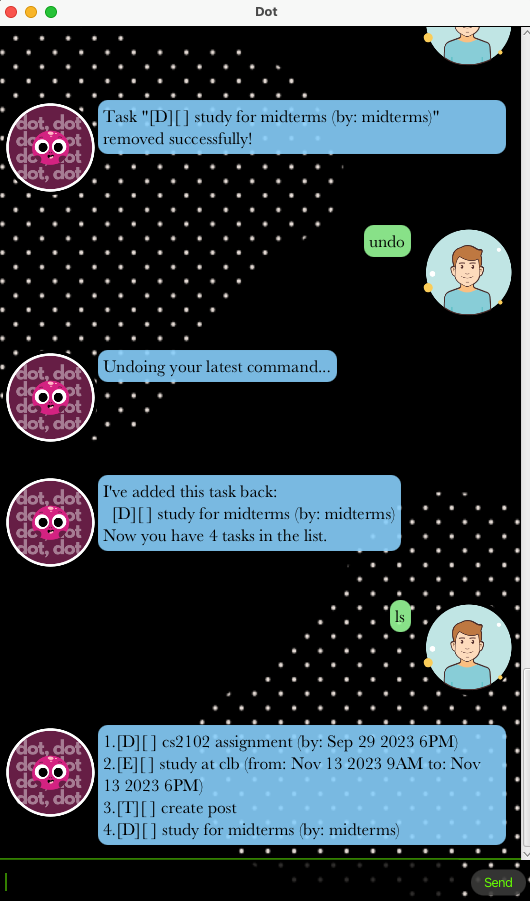

# Dot's User Guide

## A quick look
 \
It also supports resizing and elegant error handling!

## Table of Contents

- [Quick Start](#quick-start)
- [An Overview of Unique Features](#an-overview-of-unique-features)
    - [Adding of 3 types of Tasks–Todo, Event and Deadline](#adding-of-3-types-of-taskstodo-event-and-deadline)
    - [Auto-datetime](#auto-datetime)
    - [Undo commands that changes tasks](#undo-commands-that-changes-tasks)
- [Usage of Features](#usage-of-features)
    - [Accessing the help menu: `help`](#accessing-the-help-menu-help)
    - [Creating a todo: `todo`](#creating-a-todo-todo)
    - [Creating a deadline: `deadline`](#creating-a-deadline-deadline)
    - [Creating an event: `event`](#creating-an-event-event)
    - [Listing all tasks: `list` or `ls`](#listing-all-tasks-list-or-ls)
    - [Marking a task as done: `mark`](#marking-a-task-as-done-mark)
    - [Marking a task as **_not_** done: `unmark`](#marking-a-task-as-not-done-unmark)
    - [Deleting a task: `delete`](#deleting-a-task-delete)
    - [Finding the deadlines or events falling on a data: `whatsgoingon`](#finding-the-deadlines-or-events-falling-on-a-data-whatsgoingon)
    - [Finding the tasks matching some text: `find`](#finding-the-tasks-matching-some-text-find)
    - [Undoing a command: `undo`](#undoing-a-command-undo)
- [FAQ](#faq)

## Quick Start

1. Check that you have Java 11 installed.
2. Download the latest `dot.jar` release from
   our [GitHub Page](https://github.com/lamchenghou/ip/releases/tag/A-Release).
3. You may choose to move `dot.jar` to a preferred directory.
4. Double click `dot.jar` to launch the application.
5. Only if Step `4.` doesn't work, you can use the Command Line shell to navigate to the directory which `dot.jar`
   is in, and run `java -jar dot.jar` to launch Dot.

Next, take a look at our '[Usage of Features](#usage-of-features)' section to learn the key commands of Dot. You may
also read our [FAQ](#faq) to learn more about common queries.

## An Overview of Unique Features

### Adding of 3 types of Tasks–Todo, Event and Deadline

A [todo](#creating-a-todo-todo) is a simple task with a description, you can use
a [deadline](#creating-a-deadline-deadline) task if you prefer setting a deadline. \
You can specify an [event](#creating-an-event-event) with start and end date!

### Auto-datetime

When adding [deadlines](#creating-a-deadline-deadline) or [events](#creating-an-event-event),
you can choose to use the auto datetime formatter. Instead of `deadline_desc`, `start`, or
`end`, write a datetime in the following format: `dd/MM/YYYY hhmm` e.g. `17/09/2023 2300`.

It will be translated to `Sep 17 2023 11PM`.

> !
> This is not the same format as the `whatsgoingon dd/MM/yyyy` command.

### Undo commands that changes tasks

You are able to undo the latest command if they are one of the following:

- `todo`, `deadline`, `event`
- `mark`, `unmark`
- `delete`

An undo cannot be undone, and an undo cannot be performed twice.

---
> ! Notes about the usage formats
> - Words surrounded by angle brackets `<` and `>` represent placeholders, which you can input a value into. Some
    placeholders are specified like `<deadline_desc:dd/MM/yyyy hhmm>` which means you can
    use [this datetime format](#auto-datetime).
> - It is not compulsory to specify in the required datetime format, you can input any other text
    if you like.
> - Some placeholders are specified like `<index_number>` which indicates that a task's index number
    is expected.

A task is defined as either a `todo`, `event`, or `deadline`.

## Usage of Features

### Accessing the help menu: `help`

> Format: `help`

### Creating a todo: `todo`

> Format: `todo <description>` \
> Example: `todo assignment1`

### Creating a deadline: `deadline`

> Format: `deadline <description> /by <deadline_desc:dd/MM/yyyy hhmm>` \
> Examples:  \
> `deadline assignment 2 /by 20/09/2023 1800` \
> `deadline assignment 2 /by this sunday`

### Creating an event: `event`

> Format: `event <description> /from <start:dd/MM/YYYY hhmm> /to <end:dd/MM/yyyy hhmm>` \
> Examples: \
> `event recess week /from 25/09/2023 0000 /to 01/10/2023 2359` \
> `event leap year /from start 2020 /to end 2020`

### Listing all tasks: `list` or `ls`

> Format: `undo` \
> This shows a list of all tasks and their index number. **This index number must be used in
> `mark`, `unmark`, `delete`.**

### Marking a task as done: `mark`

> Format: `mark <index number>` \
> Example: `mark 1` (given that at least 1 task exist)

### Marking a task as **_not_** done: `unmark`

> Format: `unmark <index number>` \
> Example: `mark 1` (given that at least 1 task exist)

### Deleting a task: `delete`

> Format: `delete <index number>` \
> Example `delete 1` (given that at least 1 task exist)

### Finding the deadlines or events falling on a data: `whatsgoingon`

> Format: `delete <dd/MM/yyyy>` \
> Example `whatsgoingon 25/09/2023`

### Finding the tasks matching some text: `find`

> Format: `find <query>` \
> Example: `find assignment`

### Undoing a command: `undo`

The list of commands that can be undone and restrictions can be found [here](#undo-commands-that-changes-tasks).

> Format: `undo`

---

# FAQ

**Q**: The text size is too small, how do I increase the font size? \
**A**: The window is resizeable. You can choose to drag from the edges of the window, or use the maximize button located
at the top left of the window.

**Q**: Why can't I `undo` the latest command? \
**A**: You can only `undo` commands related to creating, (un)marking and deleting tasks. You can only undo such a
command once, and the `undo` command cannot be undone.